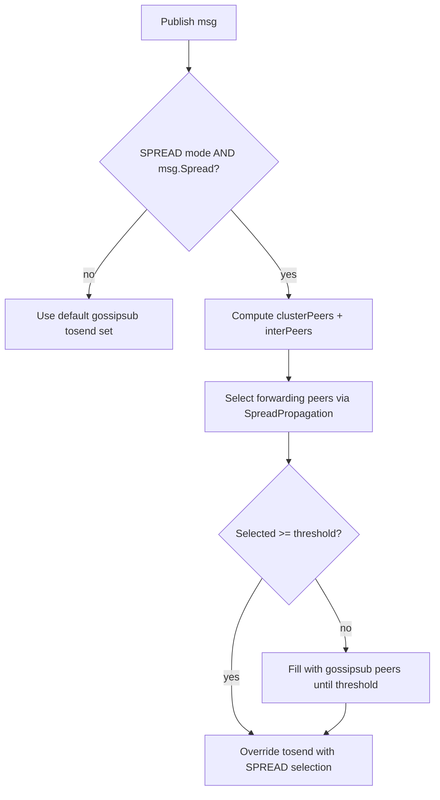

# SPREAD Clustering And Propagation

This document describes how the current SPREAD implementation derives a peer's "local cluster" and the set of "inter" peers used by the propagation selector.

## Files

- Clustering state and computation: `spread_state.go` (`SpreadState.GetPropagationPeers`)
- Propagation peer selection (fanout/probabilities): `spread_propagation.go` (`SpreadPropagation.GetPeersForPropagation`)
- Publish hook (switches from gossipsub -> SPREAD when enabled): `gossipsub.go` (`GossipSubRouter.rpcs`)
- Config options:
  - `WithSpreadClusteringConfig` in `extensions.go`
  - `WithSpreadPropagationConfig` in `gossipsub.go`
  - Vivaldi runner wiring via `WithVivaldi` in `extensions.go`

## High-Level Flow

SPREAD is only used when both conditions hold:

- Router is configured for SPREAD mode: `WithProtocolChoice(SPREAD)`
- The message is marked as spread at the `Message` level: `msg.Spread == true`

If SPREAD selects fewer peers than the configured fallback threshold, the router fills the selection with peers from the default gossipsub peer set (mesh/fanout/direct/floodsub logic).



## Basic Concepts

### Topic-local peer universe

Clustering is topic-aware and ignores non-subscribed peers:

- Start from the set of SPREAD peers subscribed to the topic.
- Exclude `self` for selection.

This peer set comes from SPREAD extension topic tracking in `SpreadState` (updated when peers announce subscriptions).

### Vivaldi coordinates

The implementation uses the Vivaldi "height-vector" distance to estimate RTT-like proximity:

```
dist(a, b) = sqrt((ax - bx)^2 + (ay - by)^2) + ah + bh
```

Only peers with a known peer state (`vsvc.GetPeerState(peer) != nil`) are considered "known" for coordinate-based sorting.

### Known vs unknown peers

- Known peers: have a Vivaldi state recorded in the local `vivaldi.Service`.
- Unknown peers: are spread peers in the topic, but do not yet have a recorded Vivaldi state.

Unknown peers are still eligible for inter-peer selection (see below).

## Clustering Algorithm

### Configuration

`SpreadClusteringConfig` controls cluster sizing and ring partitioning:

- `ClusterPct` (float in `(0, 1]`): percentage of topic peers (excluding self) considered to be in the local cluster.
- `NumRings` (int > 0): number of equal-sized rings to partition the non-cluster known peers.

Defaults (if unset/invalid):

- `ClusterPct = 0.25`
- `NumRings = 3`

### Steps

Given a topic `t` and `self`:

1. Build `topicSet` = all SPREAD peers subscribed to `t`, excluding `self`.
2. Compute `clusterSize = ceil(ClusterPct * |topicSet|)`, clamped to a minimum of `1`.
3. Fetch a constantly updated global list of known SPREAD peers sorted by `dist(self, peer)` ascending.
4. Filter that sorted list by topic membership, producing `knownInTopic`.
5. The local cluster is the first `clusterSize` peers of `knownInTopic` (or fewer if not enough known peers).
6. The remaining *known* peers in-topic are partitioned into `NumRings` equal-sized rings, then flattened back into a single list.
7. The inter-peer list is:
   - all remaining known peers (post-cluster, post-ring partitioning; currently flattened), plus
   - all unknown peers in the topic.

**Notes:**

- Cluster membership is *local* (there is no global agreement).
- When Vivaldi has not converged or peer states are sparse, the cluster may be small (or empty) because only known peers can appear in the cluster.
- Unknown peers are not discarded; they are treated as inter peers until they system learns their coordinates.

## Inter-Peer Selection

Propagation selection is controlled by `SpreadConfig` (defaults shown):

- Intra:
  - Always pick 1 peer from `clusterPeers` if non-empty.
  - With probability `IntraRho` (default `0.6`), pick up to `IntraFanout - 1` additional random cluster peers.
- Inter:
  - With probability `InterProb` (default `0.8`), pick `InterFanout` random peers from `interPeers`.
- Fallback:
  - `FallbackThreshold` (default `1`) is the minimum forwarding set size when SPREAD is active.
  - If SPREAD selection has fewer than `FallbackThreshold` peers, gossipsub peers are added until the threshold is reached or no more peers exist.

All selections are random sampling with replacement; the final forwarding set is deduplicated by using a map.

## Rings

### Current behavior

Rings are computed but not used as distinct tiers during selection:

- Known non-cluster peers are split into `NumRings` equal-sized buckets.
- Those rings are immediately flattened into a single `inter` list.
- Inter selection samples randomly across the whole flattened set (plus unknown peers).

### How rings could be used in the future

The existing ring partitioning allows introducing explicit multi-scale propagation without changing the clustering interface:

**Example**: Per-ring quotas, such as picking 1 peer per ring, or exponentially less per farther rings.

## Caching and Updates (Performance)

To stay lightweight, clustering maintains a local cache of:

- a list of known spread peers sorted by Vivaldi distance to `self`
- a set form of the same list for O(1) "known vs unknown" checks

The cache is invalidated ("dirty") when:

- SPREAD peer membership changes
- topic membership changes
- Vivaldi updates run (runner ticks or explicit updates)

The expensive sort is recomputed when a caller needs propagation peers and the cache is dirty.

## Fallback Semantics

When SPREAD is enabled for a message:

1. Build SPREAD-selected peers (`cluster + inter` via `SpreadPropagation`).
2. If selected peers are fewer than `FallbackThreshold`, add peers from the default gossipsub set.
3. Stop adding as soon as the threshold is reached.

This keeps SPREAD as primary selection while preventing very small fanout under sparse coordinates or low-probability random choices.
