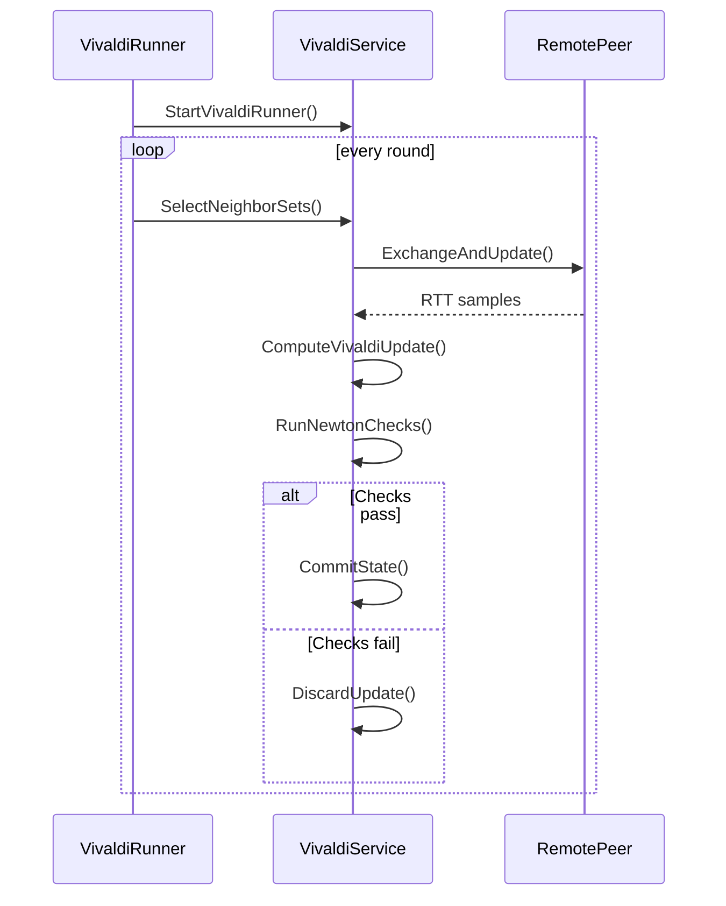

# Vivaldi + Newton Module

## Scope
This package provides:
- A decentralized Vivaldi coordinate service over libp2p streams.
- A periodic runner that exchanges coordinate samples with peers.
- Newton-style safety checks (IN1, IN2, IN3) to reject malicious or inconsistent updates.

The implementation uses:
- RTT in milliseconds.
- Height-vector coordinates (same as in Vivaldi paper).
- Per-update discard on invariant violation.

## Runtime Flow
1. `SpreadState.StartVivaldiRunner` snapshots spread peers.
2. It selects a neighbor set each round:
- half low-latency peers (`close`) from observed RTT history.
- half random peers (`random`) from remaining peers.
3. Neighbor classes are installed in `Service.SetNeighborSets`.
4. For each selected peer, `Service.ExchangeAndUpdate`:
- performs `Samples` exchanges.
- picks the median RTT sample.
- computes the Vivaldi update.
- runs Newton checks (IN2, IN1, IN3).
- if checks pass, commits local and peer state.
- if any check fails, discards the update.

## Main State
### Coordinate state
- `local`: local `VivaldiState` (`Coord`, `Error`).
- `peerStates`: last known remote state per peer.
- `peerRTTms`: last median RTT per peer (for close/random selection).

### Newton state
- `closePeers`, `randomPeers`: current round classes.
- `peerMeta`: metadata per peer for Newton checks, including:
  - `LastReported`: last reported coordinate for a peer.
  - `ExpectedMove`: accumulated expected displacement (IN2).
  - `HasLast`: whether previous coordinate exists.
  - `forceClose`, `forceRandom`: rolling force magnitude history for IN3.

## Vivaldi Update (Algorithm 1)
Given local node $i$, remote node $j$, measured RTT $\mathrm{RTT}_{ij}$:

Height-vector subtraction:
$$
[x_i, h_i] - [x_j, h_j] = [x_i - x_j,\; h_i + h_j]
$$

Height-vector norm:
$$
\|[x, h]\| = \sqrt{x_x^2 + x_y^2} + h
$$

Predicted RTT:
$$
\widehat{\mathrm{RTT}}_{ij} = \|[x_i, h_i] - [x_j, h_j]\|
$$

Sample weight:
$$
w = \frac{e_i}{e_i + e_j}
$$

Sample relative error:
$$
e_s = \frac{\left|\widehat{\mathrm{RTT}}_{ij} - \mathrm{RTT}_{ij}\right|}{\mathrm{RTT}_{ij}}
$$

Error update:
$$
\alpha = c_e \cdot w,\qquad
e_i' = \alpha e_s + (1-\alpha)e_i
$$

Coordinate step:
$$
\delta = c_c \cdot w,\qquad
x_i' = x_i + \delta\left(\mathrm{RTT}_{ij} - \widehat{\mathrm{RTT}}_{ij}\right)u\!\left([x_i,h_i]-[x_j,h_j]\right)
$$

Where $u(\cdot)$ is the unit vector over the height-vector representation.

## Newton Checks
Checks are run before committing an update.

### IN1: Centroid consistency (random set)
- Uses only the current `randomPeers` set plus local node.
- Computes centroid and its distance to origin.
- Reject if:
$$
\|\mathrm{centroid}\| > T_{\mathrm{IN1}}
$$
- Default $T_{\mathrm{IN1}} = 20\text{ ms}$.

### IN2: Physically-close projection consistency
- Applies only to peers in current `closePeers`.
- Compares observed displacement vs expected projected displacement.
- Let:
- $\Delta x_{\mathrm{obs}} =$ incoming minus last reported coordinate.
- $\Delta x_{\mathrm{exp}} =$ accumulated projected expected move.
- Reject if:
$$
\|\Delta x_{\mathrm{obs}} - \Delta x_{\mathrm{exp}}\|_2 > T_{\mathrm{IN2}}
$$
- Uses plain Euclidean norm over $(X,Y,H)$.
- Default $T_{\mathrm{IN2}} = 35\text{ ms}$.

### IN3: Force outlier detection (MAD)
- Uses force magnitude history per class (`close` vs `random`).
- Computes median $\tilde{f}$ and MAD $D$ over history.
- Reject if:
$$
f_j > \tilde{f} + K\cdot D
$$
- Defaults:
- random peers: $K=5$.
- close peers: $K=8$.

## Violation Handling
- Any violated invariant causes immediate discard of that update, without state changes.

